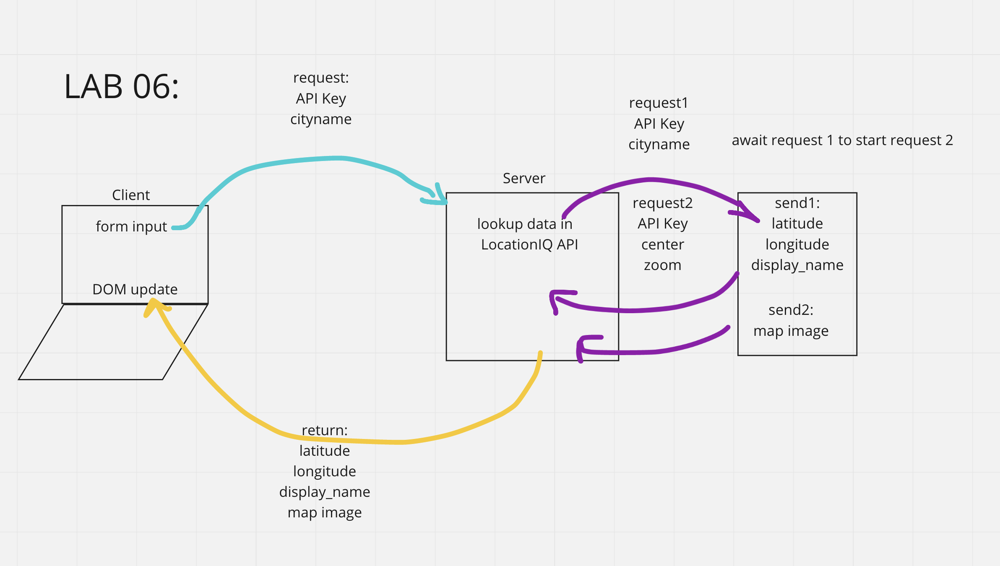
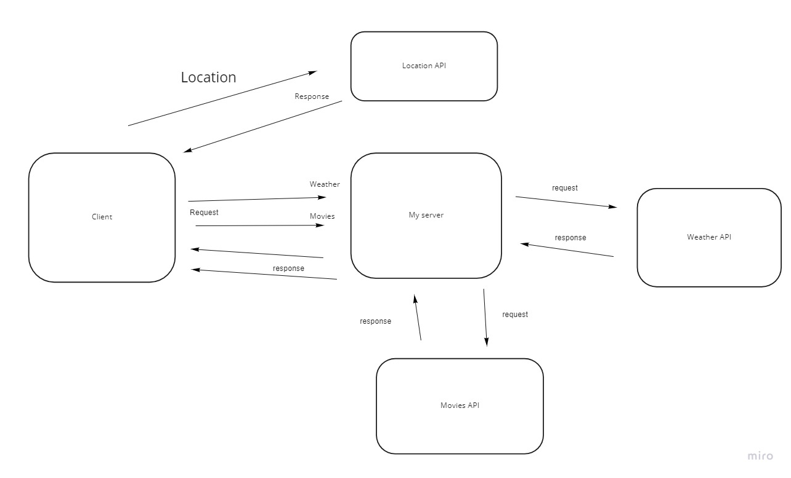
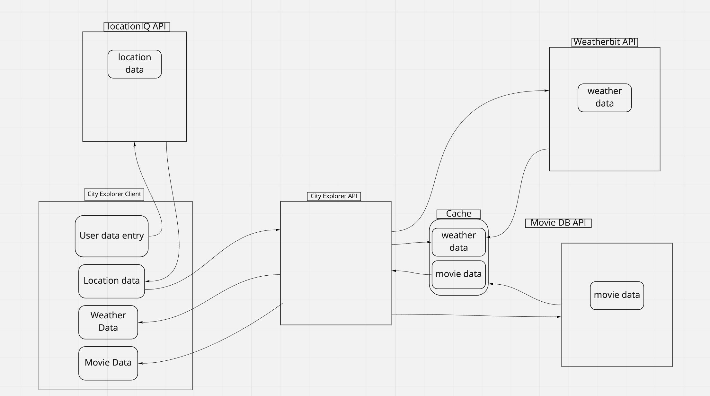

# city-explorer

**Author**: Michael Milsap
**Version**: 0.0.1

## Overview

Build and display a location on a map using API calls and outside data.

## Getting Started

started with npx-create-react-app
then installed bootstrap and axios

## Architecture

Using React and React-Bootstrap to render and present the data. I'm using the Axios library available in NPM to do my HTTP request.

## Change Log

12-06-2021 5:59pm - Successfully used the API to render Lat,Lon,Name of the inputed city. Also rendered a static of the location entered and styled.

12-10-2021 12:30am - Application talks to the backend and frontend locally and on netlify. Was able to make the code a bit mor emodular. Currently having issues with rendering a single set of Movie Data and Weather Data.

## Time

12-07-2021
Name of feature: Asynchronous Code and API Calls

Estimate of time needed to complete: 2Hours

Start time: 2pm

Finish time: 6pm

Actual time needed to complete: 3 Hours.

12-08-2021
Name of feature: Asynchronous Code and API Calls

Estimate of time needed to complete: 2Hours

Start time: 5pm

Finish time: 1130pm

Actual time needed to complete: 8 Hours.

## Credit and Collaborations

Andrew Strauch
Erik Savage
[Andrew Enyeart](github.com/aenyeart)

